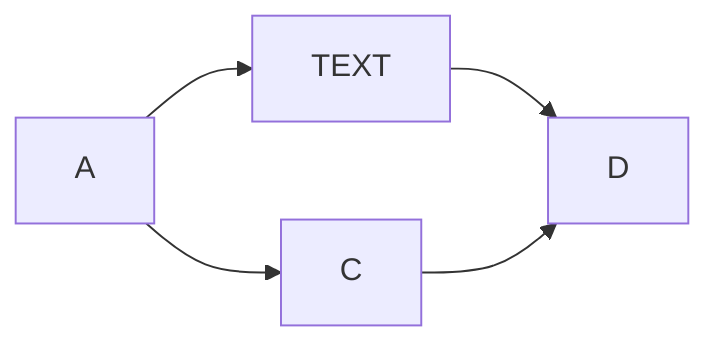

Untitled
===

blah. 

# Section 1

test content section 1 $$a_i = \int dx f(x)$$

## Subsection 1.1

test 1.1

## Subsection 1.2

test 1.2

# Section 2

test section content 2



# Section 3

```cpp
#include<iostream>
```
