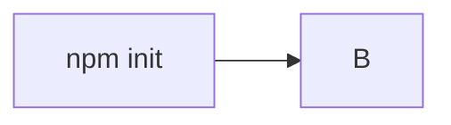

Learning Typescript
===

Typescript is a superset of Javascript and is used to develop large-scale web applications. 

# Workflow

Workflow is important in the era of programming copilot. 
It determines on a high level the sequence of incremental developments in a project, hence providing a meaningful context to the copilot at any time during the development progress. Copilot is essentially copy-paste from other's solutions. When programming with a copilot, there is a tendency of rushing too quickly to the apparent solution without preparation. Reflecting on my own experience, I have to make my hands dirty only when the copilot fails to resolve difficult bugs due to complicated context. These bugs are often introduced in a hurry. 

## Typical workflow 

# Type

The headache of programming in a disciplined language is much better than the brain damage suffered in debugging a type-free language. Javascript is an example. By introducing type into the language, many modern programming language concepts are appreciated. I would say

$${\rm Type} = \frac{\rm Typescript}{\rm Javascript}$$

Let us look into details.

